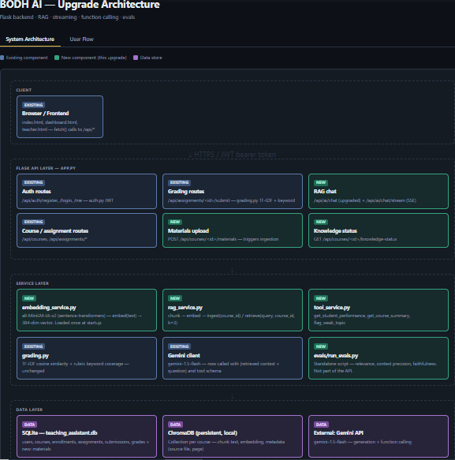
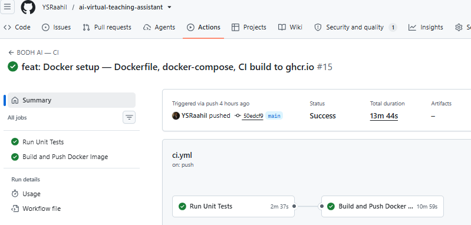

<div align="center">

# 🎓 BODH AI — Virtual Teaching Assistant

**RAG-powered AI teaching assistant. Auto-grades assignments. Tracks student progress. Answers questions grounded in course material.**

[](https://python.org)
[](https://flask.palletsprojects.com)
[](https://sqlite.org)
[](https://groq.com)
[](https://trychroma.com)
[](https://jwt.io)
[](https://github.com/YSRaahil/ai-virtual-teaching-assistant/actions)
[](https://ai-virtual-teaching-assistant.onrender.com)

🏆 **1st Place — TechXcelerate 2025, BITS Pilani Hyderabad** &nbsp;|&nbsp; 700+ teams &nbsp;|&nbsp; ₹26,000 prize

[**Live Demo →**](https://ai-virtual-teaching-assistant.onrender.com)

</div>

## What is BODH AI?

BODH AI started as a 24-hour hackathon project and was rebuilt into a production-grade backend with a full RAG pipeline, agentic AI, and a custom evaluation framework.

**What it does:** Teachers upload course PDFs. Students ask questions and get answers grounded in that material — not from the model's generic knowledge. Assignments are auto-graded using a custom TF-IDF + keyword coverage engine. The AI decides at runtime whether to answer from retrieved course content or call a tool to fetch real student data.

**The upgrade in one line:** Hackathon MVP → RAG pipeline + agentic tool calling + SSE streaming + eval framework + pytest suite + GitHub Actions CI + Docker.

---

## Architecture

```
                         ┌────────────────────────────────────────────┐
                         │ Flask REST API │
                         │ │
  Client Request ───────►│ auth.py → JWT + RBAC decorators │
                         │ app.py → 24 routes │
                         │ models.py → all DB queries │
                         │ grading.py → TF-IDF auto-grader │
                         │ analytics.py → performance insights │
                         └──────────┬─────────────┬──────────────────┘
                                    │ │
               ┌────────────────────▼──┐ ┌────▼──────────────────────┐
               │ SQLite Database │ │ RAG Pipeline │
               │ │ │ │
               │ users │ │ embedding_service.py │
               │ courses │ │ → all-MiniLM-L6-v2 │
               │ enrollments │ │ → 384-dim vectors │
               │ assignments │ │ │
               │ submissions │ │ rag_service.py │
               │ grades │ │ → ChromaDB (persistent) │
               │ materials │ │ → ingest / retrieve │
               └───────────────────────┘ └────────────┬──────────────┘
                                                         │
                                            ┌────────────▼──────────────┐
                                            │ Groq — LLaMA 3.3 70B │
                                            │ │
                                            │ tool_service.py │
                                            │ → get_student_performance│
                                            │ → get_course_summary │
                                            │ → flag_weak_topic │
                                            └───────────────────────────┘
```

<!-- IMAGE 2: Add the architecture diagram image here if you have one -->
<!-- You can export the HTML diagram from earlier as a PNG and add it -->


---

## What Was Actually Built (Upgrade Summary)

| Phase | Feature | Details |
|---|---|---|
| 1 | **Embedding service** | all-MiniLM-L6-v2, 384-dim vectors, lazy-loaded to save memory |
| 2 | **RAG pipeline** | ChromaDB persistent, per-course collections, overlapping chunks (300w/50w overlap) |
| 3 | **Materials upload** | PDF → PyMuPDF → chunks → embed → ingest. New `POST /api/courses/<id>/materials` |
| 3 | **RAG-grounded chat** | `/api/ai/chat` upgraded — retrieves top-3 chunks before calling Groq |
| 3 | **SSE streaming** | New `POST /api/ai/chat/stream` — tokens arrive as Groq produces them |
| 4 | **Tool calling** | 3 tools with Groq function calling schema — model decides at runtime |
| 5 | **Eval framework** | 20 test cases, 4 metrics — all above 80% target |
| 6 | **pytest suite** | 84 tests across 5 files — unit + integration |
| 7 | **GitHub Actions CI** | Tests + Docker build on every push to main |
| 8 | **Docker** | Image built and pushed to ghcr.io via CI |

---

## Eval Results

Custom evaluation framework built from scratch — no RAGAS dependency.

| Metric | Score | Target |
|---|---|---|
| Answer Relevance | **81.8%** | >80% ✅ |
| Context Precision | **89.8%** | >80% ✅ |
| Faithfulness | **90.2%** | >80% ✅ |
| Tool Accuracy | **100%** | >80% ✅ |

20 test cases — 13 RAG questions on ML/AI concepts, 7 tool-calling scenarios.

---

## Top 5 Bugs and How I Fixed Them

### 1. ChromaDB type hint incompatibility
**Error:** `TypeError: unsupported operand type(s) for |: 'function' and 'NoneType'`

`chromadb==0.5.3` exposes `PersistentClient` as a function, not a type-hintable class. Code written for a newer version used `chromadb.PersistentClient | None` as a type annotation — Python tried to evaluate `function | None` and crashed.

**Fix:** Removed the type hint entirely. Changed `_client: chromadb.PersistentClient | None = None` to `_client = None` and removed the return type from `_get_client()`. Type annotations should always be verified against the actual installed library version.

---

### 2. Groq tool call `student_id` schema conflict
**Error:** `tool call validation failed: parameters for tool get_student_performance did not match schema: errors: ['/student_id': expected integer, but got string]`

The LLM was passing `student_id` as a string `"12345"` because it was reading the user ID from the conversation context and serialising it as a string. Groq's validator expected an integer per the schema.

**Fix:** Added `student_id` back to the schema as a required integer so Groq's validator is satisfied, but overwrote it server-side from the JWT token before executing the tool. The LLM passes `0`, the backend always replaces it with the real authenticated user ID. Security is maintained — the LLM never controls which student's data is fetched.

---

### 3. `tc` vs `tool_call` variable mismatch
**Error:** `'list' object has no attribute 'id'`

Inside the tool call loop, the list comprehension iterated `for tc in message.tool_calls` but the dict fields referenced `message.tool_calls.id` — treating the list as a single object instead of iterating it.

**Fix:** Changed all field references inside the comprehension to use `tc.id`, `tc.function.name`, `tc.function.arguments` — consistent with the loop variable. Caught this category of bug earlier in future changes using `pyflakes` pre-push.

---

### 4. GitHub Actions CI failing on masked secrets
**Error:** `httpcore.LocalProtocolError: Illegal header value b'***'`

GitHub masks secrets in CI logs by replacing them with `***`. When `GROQ_API_KEY` was passed to the Groq client in CI, the SDK received the literal string `***` as the API key and tried to use it as an HTTP Authorization header — which httpcore correctly rejected as an illegal value.

**Fix:** Added a `_is_valid_key()` guard that checks for `***`, empty strings, and keys shorter than 20 characters before instantiating the Groq client. If the key is invalid, the test module skips entirely using `pytest.skip(..., allow_module_level=True)`. Mock client used for CI, real client used locally.

---

### 5. Render OOM on free tier (512MB)
**Error:** `Out of memory (used over 512Mi)`

`sentence-transformers` pulls `torch` as a dependency. The GPU version of torch (installed by default) includes `nvidia-cublas`, `cuda-toolkit`, `nvidia-cudnn` — adding ~400MB on top of the model's ~90MB. Combined with 2 gunicorn workers (doubling everything), the app exceeded 512MB before handling a single request.

**Fix:** Three changes together brought memory under 512MB:
- Switched to CPU-only torch: `torch==2.1.0+cpu` with PyTorch's CPU wheel index — drops from ~400MB to ~180MB
- Reduced gunicorn to 1 worker with 2 threads: `--workers 1 --threads 2`
- Lazy-loaded the embedding model: `SentenceTransformer` now imports and loads only when the first PDF upload or RAG query arrives, not at startup

---

## Features

| Role | Capabilities |
|---|---|
| **Student** | Enroll in courses, submit assignments, instant graded feedback, performance trends, RAG-grounded AI chat, streaming responses |
| **Teacher** | Create courses and assignments with rubrics, upload course PDFs, view all submissions, class analytics, AI content generation |
| **Admin** | Platform-wide stats, user management, demo data seeding |

---

## API Endpoints

### Auth
| Method | Endpoint | Access | Description |
|---|---|---|---|
| POST | `/api/auth/register` | Public | Register student or teacher |
| POST | `/api/auth/login` | Public | Login, returns JWT |
| GET | `/api/auth/me` | Any | Get current user |

### Courses + Materials
| Method | Endpoint | Access | Description |
|---|---|---|---|
| GET | `/api/courses` | Any | List courses |
| POST | `/api/courses` | Teacher | Create course |
| GET | `/api/courses/<id>` | Any | Course detail |
| POST | `/api/courses/<id>/enroll` | Student | Enroll |
| GET | `/api/courses/<id>/students` | Teacher | Enrolled students |
| GET | `/api/courses/<id>/analytics` | Teacher | Class analytics |
| POST | `/api/courses/<id>/materials` | Teacher | Upload PDF → RAG ingest |
| GET | `/api/courses/<id>/knowledge-status` | Any | ChromaDB chunk count + sources |

### Assignments
| Method | Endpoint | Access | Description |
|---|---|---|---|
| POST | `/api/courses/<id>/assignments` | Teacher | Create with rubric |
| GET | `/api/assignments/<id>` | Any | Assignment detail |
| POST | `/api/assignments/<id>/submit` | Student | Submit → auto-graded |
| GET | `/api/assignments/<id>/submissions` | Teacher | All submissions |

### AI
| Method | Endpoint | Access | Description |
|---|---|---|---|
| POST | `/api/ai/chat` | Any | RAG-grounded chat + tool calling |
| POST | `/api/ai/chat/stream` | Any | SSE streaming version |
| POST | `/api/ai/generate-content` | Teacher | Lesson summaries, quizzes, explanations |

### Analytics + Admin
| Method | Endpoint | Access | Description |
|---|---|---|---|
| GET | `/api/students/<id>/performance` | Student | Grade history + weak topics |
| GET | `/api/admin/users` | Admin | All users |
| GET | `/api/admin/stats` | Admin | Platform stats |
| POST | `/api/admin/seed` | Admin | Seed demo data |
| GET | `/api/health` | Public | Health check |

---

## Database Schema

```sql
users (id, name, email, password_hash, role, created_at)
courses (id, title, description, teacher_id, created_at)
enrollments (id, student_id, course_id, enrolled_at)
assignments (id, course_id, title, description, rubric_keywords, max_score, due_date)
submissions (id, assignment_id, student_id, content, submitted_at)
grades (id, submission_id, score, feedback, graded_by, graded_at)
materials (id, course_id, filename, original_name, chunk_count, uploaded_by, uploaded_at)
```

Normalised to 3NF. Foreign keys enforced. `materials` table tracks ingested PDFs for ChromaDB reload on cold start.

---

## Project Structure

```
ai-virtual-teaching-assistant/
├── app.py # Flask app — 24 API routes
├── models.py # Database schema + all queries
├── grading.py # TF-IDF auto-grading engine
├── analytics.py # Performance analytics
├── auth.py # JWT auth + role decorators
├── embedding_service.py # all-MiniLM-L6-v2 embeddings (lazy-loaded)
├── rag_service.py # ChromaDB ingest + retrieve
├── tool_service.py # Groq function calling tools
├── requirements.txt
├── Procfile
├── Dockerfile
├── docker-compose.yml
├── .env.example
├── pytest.ini
├── tests/
│ ├── conftest.py
│ ├── test_phase1_embeddings.py # 17 tests
│ ├── test_phase2_models.py # 18 tests
│ ├── test_phase3_api.py # 19 tests
│ └── test_tool_service.py # 25 tests
├── evals/
│ ├── run_evals.py
│ ├── test_cases.json
│ └── results/
├── templates/
│ ├── index.html
│ ├── dashboard.html
│ ├── teacher.html
│ └── admin.html
└── .github/
    └── workflows/
        └── ci.yml # Tests + Docker build on push
```

---

## Local Setup

### Prerequisites
- Python 3.11+
- Groq API key (free at [console.groq.com](https://console.groq.com))

### 1. Clone

```bash
git clone https://github.com/YSRaahil/ai-virtual-teaching-assistant.git
cd ai-virtual-teaching-assistant
```

### 2. Virtual environment

```bash
python -m venv venv
venv\Scripts\activate # Windows
# source venv/bin/activate # Mac/Linux
```

### 3. Install dependencies

```bash
pip install -r requirements.txt
```

### 4. Configure environment

```bash
cp .env.example .env
```

Edit `.env`:
```env
SECRET_KEY=any-long-random-string
GROQ_API_KEY=your_groq_key
DB_PATH=teaching_assistant.db
CHROMA_DB_PATH=./chroma_db
ANONYMIZED_TELEMETRY=False
```

### 5. Run

```bash
python app.py
```

Open [http://localhost:5000](http://localhost:5000)

### 6. Seed demo data

Hit `POST /api/admin/seed` after logging in as admin, or use the Admin dashboard.

| Email | Password | Role |
|---|---|---|
| admin@demo.com | admin123 | Admin |
| teacher@demo.com | teacher123 | Teacher |
| student@demo.com | student123 | Student |

### 7. Run tests

```bash
# Unit tests only (no server needed)
pytest tests/test_phase1_embeddings.py tests/test_phase2_models.py tests/test_tool_service.py -v -k "not Api"

# Full suite (server must be running)
pytest -v
```

### 8. Run evals

```bash
python evals/run_evals.py
```

---

## Docker

### Pull pre-built image from GitHub Container Registry

```bash
docker pull ghcr.io/ysraahil/ai-virtual-teaching-assistant:latest
```

### Run with docker-compose

```bash
cp .env.example .env # fill in real values
docker compose up
```

### Build locally

```bash
docker compose up --build
```

---

## Deployment on Render

1. Push to GitHub — Render auto-deploys on every push to `main`
2. Set environment variables in Render dashboard:

```
SECRET_KEY → any long random string
GROQ_API_KEY → your Groq key
FLASK_ENV → production
FRONTEND_ORIGIN → *
DB_PATH → teaching_assistant.db
CHROMA_DB_PATH → ./chroma_db
ANONYMIZED_TELEMETRY → False
```

> **Note:** Render free tier spins down after inactivity — first request takes ~30-50 seconds. ChromaDB data resets on redeploy (ephemeral filesystem). For production, use Render's persistent disk.

---

## How the Grading Engine Works

```python
# grading.py — simplified flow

def grade(answer, rubric_keywords, max_score=100):

    # 1. Tokenize — lowercase, remove stopwords
    answer_tokens = tokenize(answer)
    rubric_tokens = tokenize(rubric_keywords)

    # 2. Keyword coverage — did the student hit the rubric points?
    coverage_ratio, found, missing = keyword_coverage(answer_tokens, rubric_tokens)

    # 3. Cosine similarity — is the overall content relevant?
    sim_score = cosine_similarity(tf(answer_tokens), tf(rubric_tokens))

    # 4. Weighted composite score
    composite = (0.6 * coverage_ratio) + (0.4 * sim_score)
    score = round(composite * max_score)

    return { score, feedback, found_keywords, missing_keywords }
```

Zero external ML libraries — TF-IDF and cosine similarity implemented from scratch.

---

## Future Improvements

**Near term:**
- Refresh tokens — current implementation uses single 24hr JWT. Refresh tokens would allow stateless revocation and better mobile client support
- PostgreSQL — SQLite works for this scale. Migration path: add SQLAlchemy ORM, swap dialect, add connection pooling via pgbouncer
- Rate limiting — `flask-limiter` per IP to prevent abuse of Groq API endpoints

**Architecture:**
- Replace local sentence-transformers with a remote embedding API (HuggingFace Inference API or Groq when available) — removes torch dependency entirely and brings Render free tier memory to under 100MB
- Celery + Redis for async grading — at 1000+ concurrent submissions, move grading off the request thread
- Persistent disk on Render — ChromaDB currently resets on redeploy. $1/month Render disk or migrate to a managed vector DB (Pinecone free tier) for production

**AI quality:**
- Increase RAG k from 3 to 5 chunks for broader context retrieval
- Add re-ranking step — retrieve k=10, re-rank by relevance, pass top 3 to Groq
- Hybrid search — combine vector similarity with BM25 keyword search for better precision
- Conversation memory — current chat is stateless (each request is independent). Add sliding window message history

**Testing:**
- Increase eval test cases from 20 to 50 for more reliable metric estimates
- Add load testing with Locust to verify 1-worker gunicorn handles concurrent requests

---

## Design Decisions

**SQLite over PostgreSQL:** Zero setup — clone and run. Migration path is documented above for when it matters.

**Groq over OpenAI:** ~10x faster inference (LLaMA 3.3 70B at 500+ tokens/second), free tier generous enough for a portfolio project. Same OpenAI-compatible function calling API.

**all-MiniLM-L6-v2 over OpenAI embeddings:** No API cost, no rate limits, runs local. 384 dimensions vs 1536 — smaller but more than sufficient for course-document retrieval at this scale.

**Custom eval over RAGAS:** RAGAS requires an LLM judge call per test case — expensive and slow. Custom keyword-overlap metrics are cheaper, faster, and more transparent about what they measure.

**1 gunicorn worker over 2:** Render free tier has 512MB RAM. Two workers double memory usage. One worker with 2 threads handles concurrent requests adequately for a demo/portfolio project.

---

## Built By

**Syed Mohammad Rahil** — Backend architecture, RAG pipeline, NLP grading engine, agentic AI, REST API, auth layer, eval framework, CI/CD, deployment

[GitHub](https://github.com/YSRaahil) · [LinkedIn](https://linkedin.com/in/syed-mohammad-rahil)

---

<div align="center">

<!-- IMAGE 3: Add a screenshot of the eval results terminal output here -->
<!-- Shows the 4 metrics passing — proof of quality -->


<!-- IMAGE 4: Add a screenshot of GitHub Actions showing both jobs green -->
 

<sub>Originally built in 24 hours at TechXcelerate 2025, BITS Pilani Hyderabad (1st place, 700+ teams). Extended with RAG, streaming, agentic tool calling, evals, and CI/CD.
�
